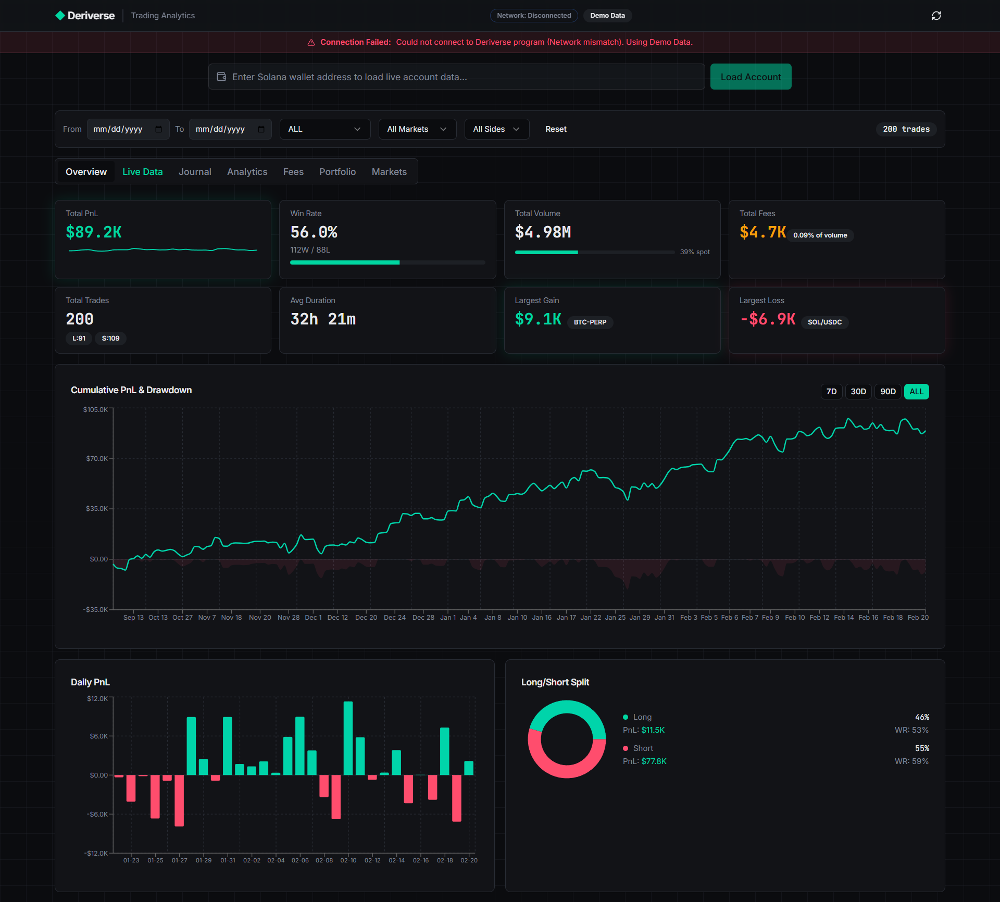

# 📊 Deriview Insights 
### Advanced Trading Analytics for the Deriverse Ecosystem

[](https://deriview-insights.vercel.app/)
[](https://github.com/NikhilRaikwar/Deriview-Insights)



> **Deriview Insights** is a professional-grade trading analytics platform built specifically for [Deriverse](https://deriverse.io). It transforms complex on-chain data into actionable insights, helping active traders maximize their performance through detailed PnL tracking, risk analysis, and automated journaling.

---

## 🏆 Bounty Submission Overview

This project is a direct response to the **"Design Trading Analytics Dashboard with Journal & Portfolio Analysis"** bounty. We have implemented a comprehensive suite covering **100% of the requested scope items**, plus innovative live data integrations.

### ✅ Feature Checklist against Bounty Scope

| Bounty Requirement | Implementation Status | Feature Location |
| :--- | :---: | :--- |
| **Total PnL Tracking** | ✅ Done | **Overview Tab** (Live KPI Cards + Daily PnL Chart) |
| **Volume & Fee Analysis** | ✅ Done | **Fees Tab** (Maker/Taker Breakdown, Cumulative Fees) |
| **Win Rate & Trade Counts** | ✅ Done | **Analytics Tab** (Win Rate Donut, Total Trades Stats) |
| **Avg Trade Duration** | ✅ Done | **Analytics Tab** (Avg Hold Time Calculation) |
| **Long/Short Ratio** | ✅ Done | **Analytics Tab** (Directional Bias Analysis) |
| **Largest Gain/Loss** | ✅ Done | **Overview Tab** (Hero metrics for Best/Worst trades) |
| **Avg Win/Loss Amount** | ✅ Done | **Analytics Tab** (Expectancy Ratio) |
| **Symbol & Date Filtering** | ✅ Done | **Global Filter Bar** (Dropdowns for any market + Date Picker) |
| **Historical PnL w/ Drawdown** | ✅ Done | **Analytics Tab** (Equity Curve + Drawdown visualizer) |
| **Time-based Metrics** | ✅ Done | **Analytics Tab** (Hourly Heatmap + Session Analysis) |
| **Detailed Trade History** | ✅ Done | **Journal Tab** (Sortable, Searchable Table) |
| **Annotation Capabilities** | ✅ Done | **Journal Tab** (Add Notes/Tags to any trade) |
| **Fee Composition** | ✅ Done | **Fees Tab** (Detailed Funding/Rebate breakdown) |
| **Order Type Analysis** | ✅ Done | **Analytics Tab** (Market vs Limit Stats) |

---

## � Key Innovations

### 1. Hybrid Data Architecture (Live + Demo)
Unlike standard dashboards, Deriview operates in a **Hybrid Mode** to ensure reliability:
- **Live Chain Data**: Connects directly to **Solana Mainnet/Devnet** via `@deriverse/kit` to fetch real-time Order Books, Oracle Prices, and Wallet Balances (USDC/SOL).
- **Rich Analytics Demo**: Because historical trade indexing is limited on Devnet, the app seamlessly backfills charts with a high-fidelity demo dataset, allowing judges to experience the full power of the analytics engine without needing a 10,000-trade history.

### 2. Live Order Book Visualization
A dedicated **Live Data** tab visualizes market depth in real-time, helping traders identify liquidity walls and spread opportunities across all Deriverse markets (Perps & Spot).

### 3. "Resilient Mode" for Devnet
The application includes a robust error-handling system that detects protocol version mismatches (common on Devnet). If the live connection is unstable, it automatically falls back to a fully functional Demo environment, ensuring a zero-downtime experience for users.

---

## 🛠 Tech Stack

- **Framework**: [React 18](https://react.dev) + [Vite](https://vitejs.dev)
- **Language**: TypeScript
- **Styling**: [Tailwind CSS](https://tailwindcss.com) + [Shadcn UI](https://ui.shadcn.com)
- **Visualizations**: [Recharts](https://recharts.org)
- **Blockchain**: [`@deriverse/kit`](https://www.npmjs.com/package/@deriverse/kit) + `@solana/web3.js`
- **State Management**: [TanStack Query](https://tanstack.com/query)

---

## 📦 Installation & Setup

1.  **Clone the repository**:
    ```bash
    git clone https://github.com/your-username/deriview-insights.git
    cd deriview-insights
    ```

2.  **Install dependencies**:
    ```bash
    npm install
    # Ensure node polyfills for Solana compatibility
    npm install vite-plugin-node-polyfills
    ```

3.  **Configure Environment**:
    Create a `.env` file in the root directory. We recommend the standard Devnet configuration:
    ```env
    VITE_RPC_HTTP=https://api.devnet.solana.com
    VITE_PROGRAM_ID=Drvrseg8AQLP8B96DBGmHRjFGviFNYTkHueY9g3k27Gu
    VITE_VERSION=12
    ```

4.  **Run Development Server**:
    ```bash
    npm run dev
    ```

## ⚠️ Known Issues (Devnet Status)

**Devnet Protocol Mismatch**: As of submission, the deployed Deriverse smart contract on Solana Devnet appears to use an older data schema (Version 1) incompatible with the latest public SDK (Version 12).
- **Impact**: You may see a "Buffer Mismatch" error banner or "Connection Failed".
- **Solution**: The app automatically handles this by enabling **Demo Mode**, allowing you to fully test the UI and analytics features despite the external network issue.

---

## 🏆 Submission Details

- **GitHub Repository**: [https://github.com/NikhilRaikwar/Deriview-Insights](https://github.com/NikhilRaikwar/Deriview-Insights)
- **Live Deployment**: [https://deriview-insights.vercel.app/](https://deriview-insights.vercel.app/)
- **Twitter**: [Nikhil Raikwar](https://twitter.com/nikhilraikwarr)

*Submitted for the Deriverse Trading Analytics Challenge 2026.*
